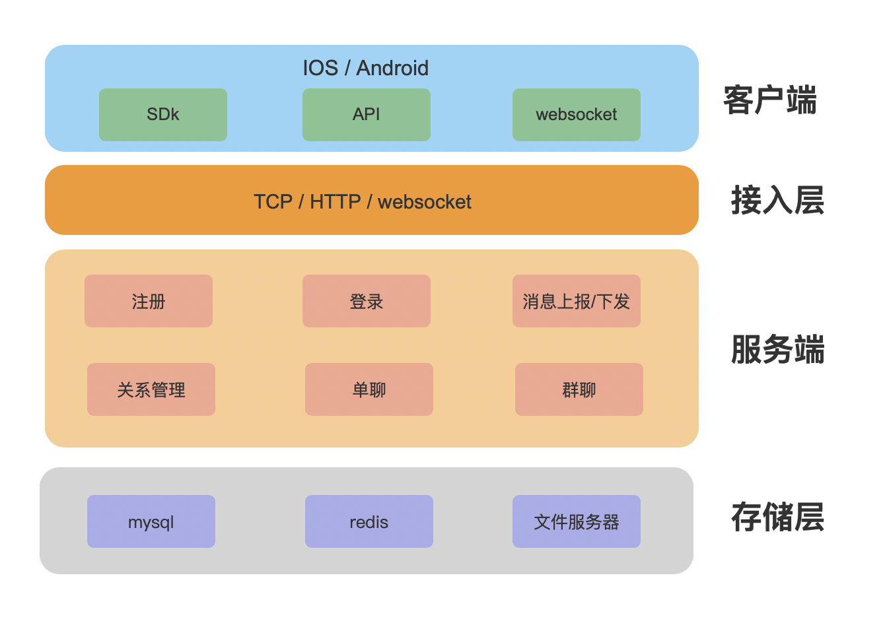
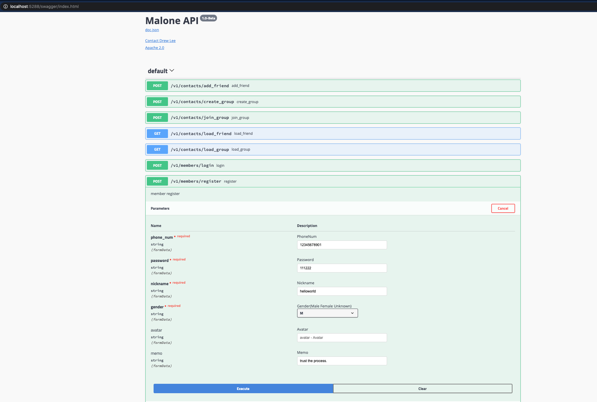
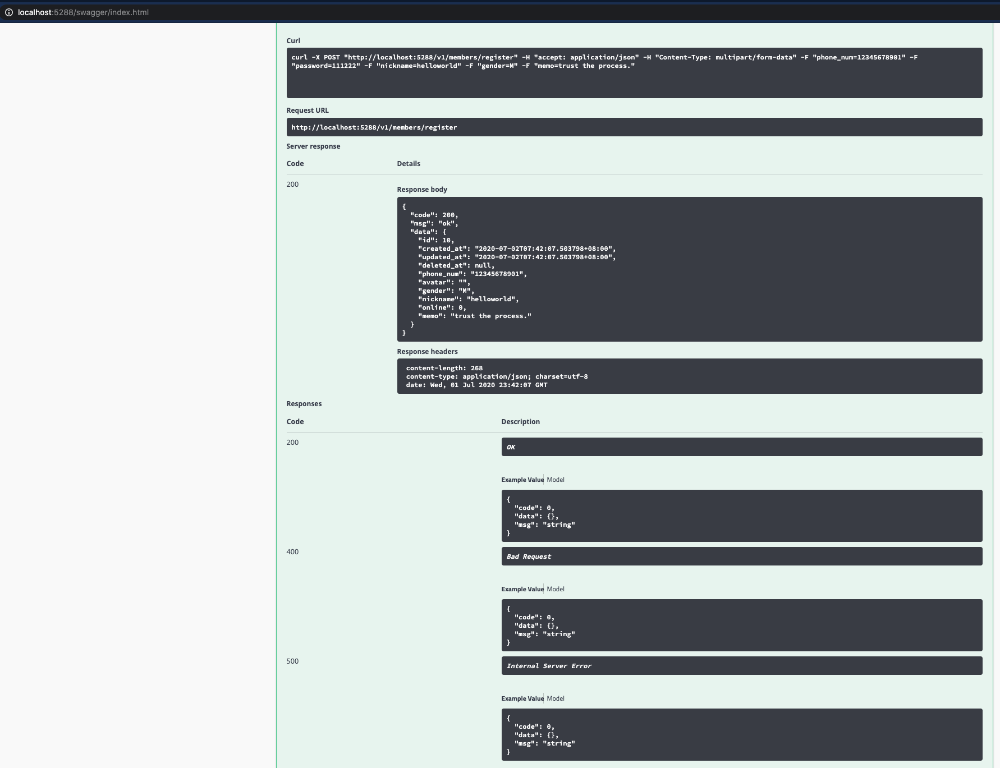

# Malone

一个可以实现高并发的IM(及时通信) api项目

## 内容列表

- [使用技术](#使用技术)
- [系统架构](#系统架构)
- [项目结构](#项目结构)
- [启动运行](#启动运行)
- [相关仓库](#相关仓库)
- [维护者](#维护者)
- [如何贡献](#如何贡献)
- [使用许可](#使用许可)

## 使用技术

数据库: mysql + [gorm](https://github.com/go-gorm/gorm)

日志框架: [zap](https://github.com/uber-go/zap)

映射配置: [viper](https://github.com/spf13/viper)

实时加载: [air](https://github.com/cosmtrek/air)

web框架: [gin](https://github.com/gin-gonic/gin)

api文档: [swag](https://github.com/swaggo/swag)

## 技术背景
本项目使用websocket协议建立客户端与服务端的长连接进行及时通讯，关于该协议的了解可以参考[websocket基础](https://github.com/HJava/myBlog/tree/master/WebSocket%20%E7%B3%BB%E5%88%97)

项目使用了golang [websocket库](https://godoc.org/github.com/gorilla/websocket), 关于该库的使用可以参考 [websocket_tutorial](./examples/websocket_tutorial)

## 系统架构
下图是完整的IM系统架构：包含了C端、接入层、S端处理逻辑和消息分发、存储层用来持久化数据。


本项目重点实现服务端和存储端（业务模块包括包括注册，鉴权登录，关系管理，单聊，群聊），代码结构清晰，性能优秀，单机支持几万人在线聊天。

### 注册示例
如下图，通过swagger输入数据即可注册新用户



#### 注册流程
注册的post请求 -> 服务器路由"/v1/members/register" -> 服务层m.Register()方法 -> 模型层models.RegisterMember(data)方法

#### register路由handler
```go
// ./api/routes/v1/members/register.go
func register(c *gin.Context) {
	r := app.Gin{C: c}

        // 创建Member结构体实例m
	m := service.Member{}
        // 绑定请求参数到实例m
	if err := c.ShouldBind(&m); err != nil {
		r.Response(http.StatusBadRequest, e.INVALID_PARAMS, nil)
	}
    
        // 调用m实例的Register()服务方法
	member, err := m.Register()
	if err != nil {
		r.Response(http.StatusInternalServerError, e.ERROR_REGISTER_MEMBER, nil)
	} else {
		r.Response(http.StatusOK, e.SUCCESS, member)
	}
}
```

#### Register()服务方法
```go
// ./internal/members.go
func (m *Member) Register() (models.Member, error) {
        // 把 绑定的参数 拼接一个data map
	data := map[string]interface{}{
		"phone_num": m.PhoneNum,
		"plain_pwd": m.Password,
		"nickname":  m.Nickname,
		"avatar":    m.Avatar,
		"gender":    m.Gender,
		"memo":      m.Memo,
	}

        // data传入model层RegisterMember方法执行创建(所有crud都在model层) 并返回创建后的member实例
	member, err := models.RegisterMember(data)

	return member, err
}
```

#### model层RegisterMember(data)执行创建用户
```go
// ./internal/models/member.go
func RegisterMember(data map[string]interface{}) (Member, error) {
	member := Member{}
        // 查询数据库中是否存在该用户
	if err := db.Where("phone_num = ?", data["phone_num"].(string)).Take(&member).Error; err != nil && !gorm.IsRecordNotFoundError(err) {
		logger.Error("model member register find error", zap.String("phone_num", data["phone_num"].(string)), zap.String("error", err.Error()))
		return Member{}, err
	}

        // id大于0表示存在该用户，返回注册失败
	if member.ID > 0 {
		err := errors.New("phone number has been registered")
		logger.Error("model member register phone_num has been registered error", zap.String("phone_num", data["phone_num"].(string)), zap.String("error", err.Error()))
		return Member{}, err
	}

        // 传参给新用户实例
	member.PhoneNum = data["phone_num"].(string)
	member.Avatar = data["avatar"].(string)
	member.Gender = data["gender"].(string)
	member.Nickname = data["nickname"].(string)
	member.Memo = data["memo"].(string)
	member.Salt = fmt.Sprintf("%06d", rand.Int31n(10000)) // 随机生成密码盐值
	member.Password = util.MakePwd(data["plain_pwd"].(string), member.Salt) // 执行加密保存

        // 存入数据库，创建用户成功
	if err := db.Create(&member).Error; err != nil {
		logger.Error("model member register create error", zap.Any("member", member), zap.String("error", err.Error()))
		return Member{}, err
	}

	return member, nil
}
```


## 项目结构
项目结构遵循 https://github.com/golang-standards/project-layout
```
    .
    ├── api                     // 接口模块
    │   └── routes              // 路由
    │       └── v1              // 路由版本
    │           ├── attaches    // 用户上传附件接收路由
    │           ├── chats       // 聊天路由
    │           ├── contacts    // 用户关系（加好友、加群、建群等）路由
    │           └── members     // 用户登录注册路由
    ├── cmd                     // 控制模块（包含项目启动调用的main.go文件）
    │   ├── api_test            // 接口测试
    │   └── base                // 项目启动前预配置（如gin添加监听日志等）
    ├── config                  // 项目配置信息（详见config.yml, conf.go负责读取yml）
    ├── docs                    // 存放swagger文档信息
    ├── examples                // 示例代码
    │   └── websocket_tutorial  // websocket库调用教程
    │       └── resources
    ├── internal                // 内部代码模块
    │   ├── models              // 模型（models.go使用gorm连接数据库，contact.go、group.go、member.go实现建模，对数据库crud）
    │   └── service             // 服务 （路由把请求发送给服务，服务拼接参数发送给模型执行crud）
    ├── log                     // 日志输出（目前主要使用[info,error,debug]三个级别的日志,前两个对应info.log,err.log; debug对应event/event.log）
    │   └── event
    ├── pkg                     // 公共代码模块
    │   ├── app                 // 应用响应
    │   ├── e                   // 错误码
    │   ├── logger              // 日志配置
    │   └── util                // 通用工具包
    ├── resources               // 用户上传文件保存目录（先暂时存到服务器）
    ├── sql                     // 建表sql语句
    ├── third_party             // 第三方服务目录
    └── tmp                     // 临时目录，存放go项目编译生成的二进制文件
```
## 启动运行

1. 安装MySQL
2. 创建数据库karlmalone，执行sql/create_table.sql，完成初始化表的创建
3. 修改config文件夹下配置文件config.yml，使之和你本地配置一致
4. 执行以下命令运行项目

    ```sh
    $ air                        # 你没看错，只用敲三个字母就可以启动项目，具体配置可见`./.air.conf`文件
    ```
   或者执行
   ```shell script
    $ swag init -g ./cmd/main.go # 更新swagger接口文档（如果更新了接口代码，则执行此句）
    $ go build -o ./tmp/malone ./cmd
    $ ./tmp/malone
   ```
5. 浏览器查看swagger api文档: `localhost:[your_port]/swagger/index.html`  (备注：[your_port] 默认为 5288)

## 相关仓库

- [gim](https://github.com/alberliu/gim) — golang写的IM服务器，支持多业务接入。
- [fastIM](https://github.com/GuoZhaoran/fastIM) — an example of im system。

## 维护者

[@UncleMaple](https://github.com/UncleMaple)

## 如何贡献

非常欢迎你的加入！[提一个 Issue](https://github.com/UncleMaple/KarlMalone/issues/new) 或者提交一个 Pull Request。


KarlMalone 遵循 [Contributor Covenant](http://contributor-covenant.org/version/1/3/0/) 行为规范。

## 使用许可

[MIT]() © Drew Lee
